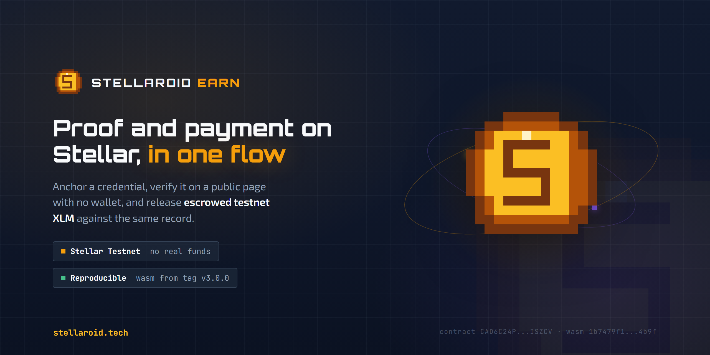
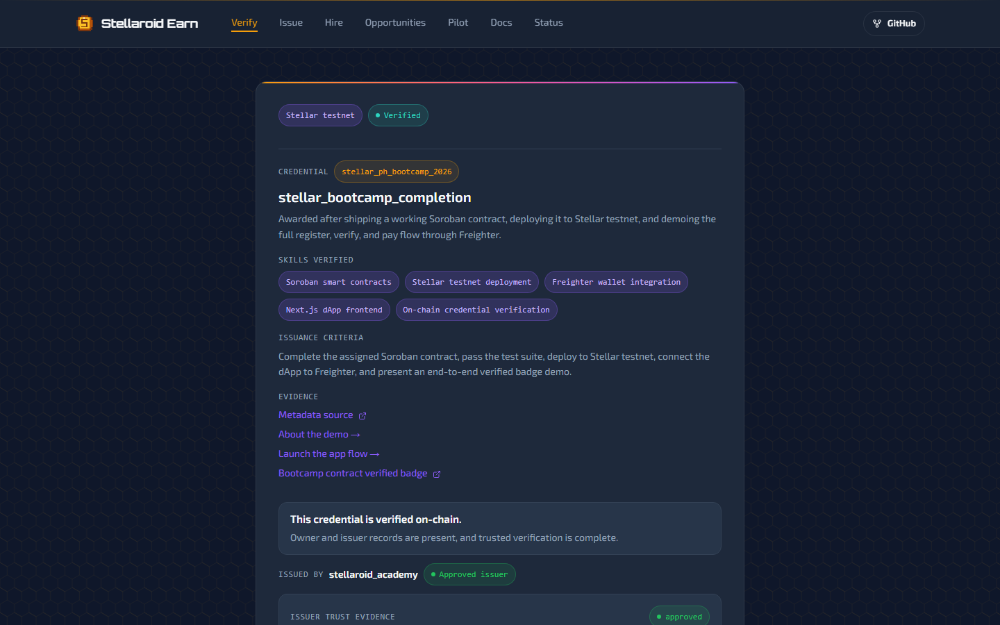
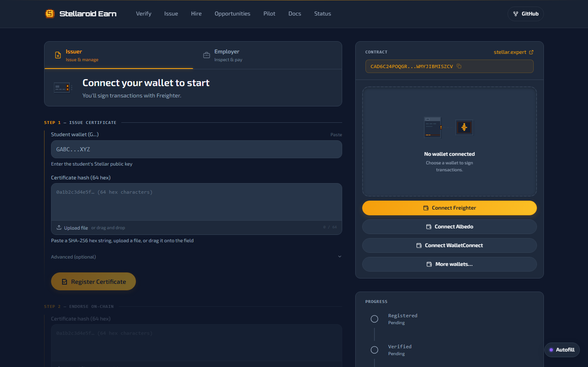
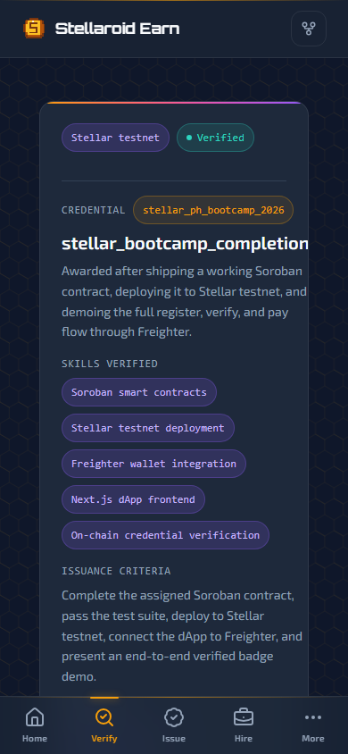
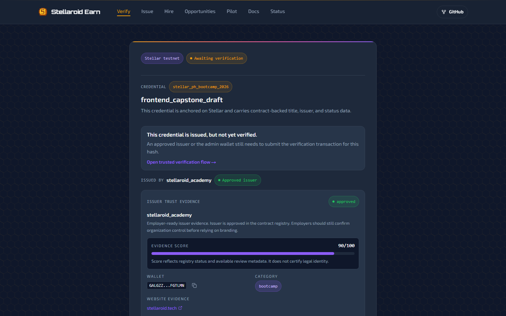
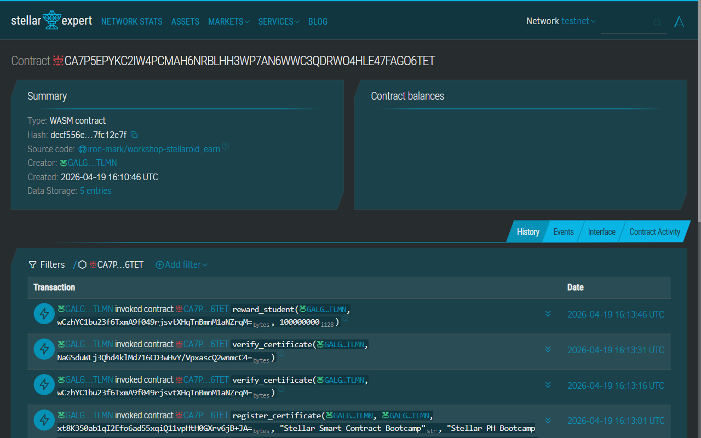
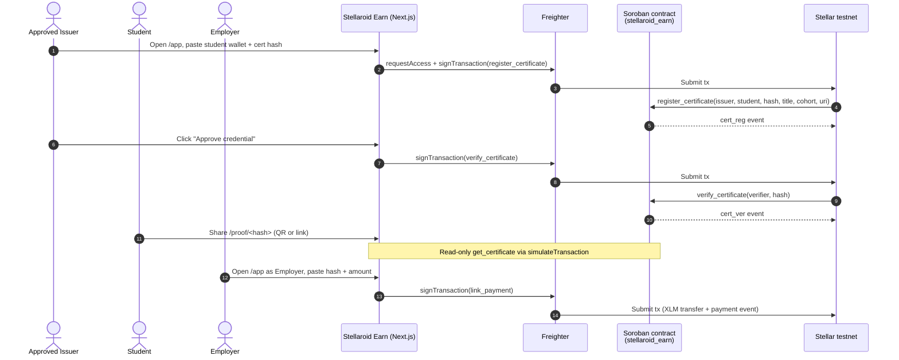

# Stellaroid Earn

**On-chain credential trust for Stellar PH Bootcamp 2026**

Issue, verify, and pay graduates on Stellar testnet  - Soroban smart contract, 8 supported wallets (Freighter, Albedo, xBull, LOBSTR & more), installable PWA, end-to-end.

[](https://stellaroid.tech/)
[](https://stellar.expert/explorer/testnet/contract/CAD6C24POQGRYXMBNBEGVDHUROF5ZC37XRDC6NCVILTXWMYJIBMISZCV)
[](https://docs.rs/soroban-sdk/26.1.0)
[](https://github.com/Iron-Mark/Hackathon-Stellaroid_Earn/actions/workflows/contract-ci.yml)
[](https://nextjs.org/)
[](LICENSE)



| | |
|---|---|
| **Live demo** | [stellaroid.tech](https://stellaroid.tech/) |
| **Contract (current)** | [`CAD6C24POQGRYXMBNBEGVDHUROF5ZC37XRDC6NCVILTXWMYJIBMISZCV`](https://stellar.expert/explorer/testnet/contract/CAD6C24POQGRYXMBNBEGVDHUROF5ZC37XRDC6NCVILTXWMYJIBMISZCV) |
| **Tx evidence** | [init](https://stellar.expert/explorer/testnet/tx/faf278d7c2e2c92faff965ee790e7a79b7188511671f175d3ed0ee7d0bf085e6) · [register](https://stellar.expert/explorer/testnet/tx/8c20a9443af1e7ea16d65b6292829a15d614858cadc6d11bef46ab246bb4a0e8) · [verify](https://stellar.expert/explorer/testnet/tx/67137aa8b3b887443be9bc2e0806a438a5c6a23beb8834cc32493a1341c82cb9) |
| **Source verification** | Deployed WASM hash `1b7479f1ca0f12846bbfdd8f0681670692e29e1f20618150912f010b7caf4b9f`, built from committed source with `source_repo` + `home_domain` metadata embedded. Attestation runbook: [`docs/operations/contract-verification.md`](docs/operations/contract-verification.md). |
| **Submission** | Rise In · Stellar Smart Contract Bootcamp · Stellar PH Bootcamp 2026 |
| **Result** | **Top 5 / 105 participants** · Score: 75.00 |


---

## Project Status

The bootcamp/event submission is complete. Stellaroid Earn is now maintained as a living Stellar credential proof project.

- **Roadmap:** [`ROADMAP.md`](ROADMAP.md)
- **Maintenance checks:** [`MAINTENANCE.md`](MAINTENANCE.md)
- **Docs index:** [`docs/README.md`](docs/README.md)
- **Release and deployment:** [`docs/operations/release-and-deployment.md`](docs/operations/release-and-deployment.md)
- **Pro-research intake:** [`docs/planning/research-intake-status.md`](docs/planning/research-intake-status.md)
- **Demo checklist:** [`docs/operations/demo-checklist.md`](docs/operations/demo-checklist.md)
- **Canonical live URL:** [`stellaroid.tech`](https://stellaroid.tech/)
- **Operational status route:** [`/status`](https://stellaroid.tech/status)
- **Pilot intake route:** [`/pilot`](https://stellaroid.tech/pilot)

`www.stellaroid.tech` and `earn.stellaroid.tech` redirect to the canonical apex URL.

### Version archive

Each monthly build cycle is preserved as a frozen snapshot at a pinned subdomain, independent of the live site:

| Version | Cycle | Snapshot |
|---|---|---|
| **v1** | April | [`v1.stellaroid.tech`](https://v1.stellaroid.tech) |
| **v2** | June | [`v2.stellaroid.tech`](https://v2.stellaroid.tech) |
| **v3** | July (current) | [`v3.stellaroid.tech`](https://v3.stellaroid.tech) |

`stellaroid.tech` always serves the latest production build (`main`). The April source lives on the `april-bootcamp-and-monthly-builder` branch; June and July on `june-monthly-builder` and `july-monthly-builder`.

### July v3.2 product surface

- **Wallet-less guided demo** - [`/demo`](https://stellaroid.tech/demo): the full register → verify → escrow → payout story on **real seeded testnet data** (a released 25 XLM escrow and a live funded one), with per-step stellar.expert audit links. No wallet, no extension, works on a phone.
- **Opportunity directory** - [`/opportunity`](https://stellaroid.tech/opportunity): every live escrowed paid trial on the contract, with wallet-scoped filters (for you / created by you) and deep links into the milestone console.
- **Live escrow evidence** - the [status page](https://stellaroid.tech/status) and activity feeds now decode all escrow events (create/fund/submit/approve/release/refund) alongside credential events, deduplicated across the RPC and the Stellar Expert indexer; `/app` shows the events involving your connected wallet.
- **On-site pilot intake** - [`/pilot`](https://stellaroid.tech/pilot#request) has a real lead-capture form (rate-limited, honeypot-guarded, delivered by email) instead of a link-out, plus [`/contact`](https://stellaroid.tech/contact), an honest [privacy & terms page](https://stellaroid.tech/privacy), and an RFC 9116 [`security.txt`](https://stellaroid.tech/.well-known/security.txt).
- **Performance pass** - the multi-megabyte stellar-sdk is lazy-loaded out of every route's First Load JS (`/app` dropped 483 → ~260 KB gzipped), the brand typefaces (Orbitron/Exo 2) are self-hosted via `next/font`, and first-party client-error telemetry reports runtime failures to server logs with no third-party service.
- **Installable PWA** - manifest with maskable icons, service worker (network-first pages, offline fallback, per-deploy cache versioning; verification pages are never served from cache), iOS splash screens. Add it to a phone home screen from the live site.
- **Mobile-first redesign** - app-style bottom navigation with a More sheet, auto-hiding header, bottom-sheet dialogs, full safe-area/notch handling.
- **Developer docs hub** - [`/docs`](https://stellaroid.tech/docs): [contract reference](https://stellaroid.tech/docs/contract) (all 19 functions, 17 error codes, 16 events), [integration](https://stellaroid.tech/docs/integration), [architecture](https://stellaroid.tech/docs/architecture), and [security posture](https://stellaroid.tech/docs/security).
- **Content engine** - audience landing pages for [bootcamps](https://stellaroid.tech/verify-bootcamp-certificate), [employers](https://stellaroid.tech/verify-candidate-credentials), and [graduate payouts](https://stellaroid.tech/instant-payouts), plus a [guides library](https://stellaroid.tech/guides) and a [verifiable-credentials glossary](https://stellaroid.tech/glossary) - all with FAQPage/HowTo/DefinedTermSet structured data and an [`llms.txt`](https://stellaroid.tech/llms.txt).
- **Multi-wallet signing** - Freighter and Albedo natively, plus xBull, Rabet, LOBSTR, Hana, Klever, and Bitget via [Stellar Wallets Kit](https://stellarwalletskit.dev/) - all behind one provider interface, lazy-loaded on first use.

The public entry flow is organized around three personas: **Issue**, **Verify**, and **Hire**. Verified proof pages now hand employers into `/employer` with the proof hash and candidate wallet preloaded, then require a review checklist before escrow creation. They also hand recruiters into `/talent/<address>?proof=<hash>` so the candidate passport can show a known proof without pretending wallet-wide credential discovery exists yet. Issuer registration now explains approval readiness before signing, and `/pilot` keeps the first rollout bounded to a small testnet issuer pilot. Employer proof packs include a recruiter-safe summary plus an unsigned standards-alignment preview for W3C VC 2.0 and Open Badges 3.0 mapping. That preview is not a signed standards credential yet.

---

## 30-Second Pitch

**Problem**  - Bootcamp certificates are PDFs that anyone can fake and no one can independently verify. Employers skip verification or pay for a background check service.

**Solution**  - Stellaroid Earn anchors credential hashes on a Soroban smart contract where approved issuers register and verify certificates, anyone checks proof at a public URL with no login, and employers pay graduates in XLM  - all on-chain.

**Why Stellar**  - Sub-cent fees and 5-second finality make issuing credentials cheap enough to never skip. `simulateTransaction` lets anyone verify with zero wallet setup. Native XLM via SAC closes the loop from proof to payout on one chain.

---

## Feature Gallery

<table>
<tr>
<td width="50%" align="center">
<br/>
<b>Discover</b>  - Landing page with 3-step how-it-works flow
</td>
<td width="50%" align="center">
<br/>
<b>Verify</b>  - On-chain credential with green Verified badge
</td>
</tr>
<tr>
<td width="50%" align="center">
<br/>
<b>Issue &amp; Pay</b>  - Dual-role dashboard for issuers and employers
</td>
<td width="50%" align="center">
<br/>
<b>Share</b>  - QR-scannable proof card on any mobile browser
</td>
</tr>
</table>

---

## Live Trust Artifact

Every credential produces a public **Verified Badge** URL  - no wallet, no login, no API key. Green means verified on-chain. Amber means issued but not yet verified.

<table>
<tr>
<td width="50%" align="center">
<br/>
<b>Verified</b><br/>
<a href="https://stellaroid.tech/proof/c02ce1602d5bbb6ddfe93c6603d7f4e3dae3b2fb571ea4e70669ccd5a359aea3">Try it yourself →</a>
</td>
<td width="50%" align="center">
<br/>
<b>Issued (locked)</b><br/>
<a href="https://stellaroid.tech/proof/c6df0adf9d1a6f5a88d847e8e9a779e71aa2435d6fa47b47d065ebbfa8c1f890">Try it yourself →</a>
</td>
</tr>
</table>

Contract on Stellar Expert: [`CAD6C24P…ISZCV`](https://stellar.expert/explorer/testnet/contract/CAD6C24POQGRYXMBNBEGVDHUROF5ZC37XRDC6NCVILTXWMYJIBMISZCV)



---

## Architecture

> Full architecture document: [`docs/reference/architecture.md`](docs/reference/architecture.md)



**Design decisions:**

- **soroban-sdk 26.1** with typed `#[contracterror]` enum (17 variants), persistent + instance storage, TTL 518k/1.04M ledgers
- **Issuer trust layer**: self-register → admin approve → issue credentials. Suspended issuers are blocked on-chain
- **Two read paths**: server-side RSC with `revalidate=60` (CDN-cached proof pages) + client-side `simulateTransaction` (dashboard state)
- **One write path**: Freighter signs → `sendTransaction` → poll for result
- **CSP** locks `connect-src` to `*.stellar.org`  - no third-party data leaks

---

## Quick Start

### Prerequisites

- Rust (stable) + `wasm32v1-none` target
- [Stellar CLI v26+](https://developers.stellar.org/docs/tools/stellar-cli)
- Node.js 20+ and npm
- [Freighter](https://www.freighter.app/) browser extension set to **Testnet**

Full setup guide: [`docs/reference/pre-workshop-setup-guide.pdf`](docs/reference/pre-workshop-setup-guide.pdf)

### Smart Contract

```bash
cd contract
cargo test                    # contract test suite
stellar contract build        # builds wasm32v1-none target

# Deploy to testnet
stellar keys generate my-key --network testnet --fund
stellar contract deploy \
  --wasm target/wasm32v1-none/release/stellaroid_earn.wasm \
  --source my-key --network testnet
```

CI runs the contract gate with `cargo test -p stellaroid_earn --locked` and `cargo build -p stellaroid_earn --target wasm32v1-none --release --locked` in [`Contract CI`](.github/workflows/contract-ci.yml).

### Frontend

```bash
cd frontend
cp .env.example .env.local    # fill in contract ID + read address
npm install
npm run dev                   # http://localhost:3000
```

**Environment variables** (`.env.local`):

```env
NEXT_PUBLIC_STELLAR_RPC_URL=https://soroban-testnet.stellar.org
NEXT_PUBLIC_STELLAR_NETWORK=TESTNET
NEXT_PUBLIC_STELLAR_NETWORK_PASSPHRASE=Test SDF Network ; September 2015
NEXT_PUBLIC_SOROBAN_CONTRACT_ID=<your deployed contract ID>
NEXT_PUBLIC_STELLAR_ADMIN_ADDRESS=<your admin G... address>
NEXT_PUBLIC_STELLAR_READ_ADDRESS=<any funded testnet address for read-only calls>
NEXT_PUBLIC_SOROBAN_ASSET_ADDRESS=CDLZFC3SYJYDZT7K67VZ75HPJVIEUVNIXF47ZG2FB2RMQQVU2HHGCYSC
NEXT_PUBLIC_SOROBAN_ASSET_CODE=XLM
NEXT_PUBLIC_SOROBAN_ASSET_DECIMALS=7
NEXT_PUBLIC_STELLAR_EXPLORER_URL=https://stellar.expert/explorer/testnet
NEXT_PUBLIC_CANONICAL_URL=https://stellaroid.tech
```

---

## Verifiable On-Chain

Every action in the demo flow is a real transaction on Stellar testnet. Click any hash to verify on Stellar Expert.

| Action | Tx Hash | Result |
|---|---|---|
| `init` | [`faf278d7…85e6`](https://stellar.expert/explorer/testnet/tx/faf278d7c2e2c92faff965ee790e7a79b7188511671f175d3ed0ee7d0bf085e6) | Contract initialized with admin + XLM token |
| `register_certificate` | [`8c20a944…a0e8`](https://stellar.expert/explorer/testnet/tx/8c20a9443af1e7ea16d65b6292829a15d614858cadc6d11bef46ab246bb4a0e8) | Demo credential hash registered for student |
| `verify_certificate` | [`67137aa8…2cb9`](https://stellar.expert/explorer/testnet/tx/67137aa8b3b887443be9bc2e0806a438a5c6a23beb8834cc32493a1341c82cb9) | Status changed to Verified |

**Live certificates** (testnet, contract [`CAD6C24P…`](https://stellar.expert/explorer/testnet/contract/CAD6C24POQGRYXMBNBEGVDHUROF5ZC37XRDC6NCVILTXWMYJIBMISZCV)):

| Hash | Cohort | Status |
|---|---|---|
| [`c02ce160…aea3`](https://stellaroid.tech/proof/c02ce1602d5bbb6ddfe93c6603d7f4e3dae3b2fb571ea4e70669ccd5a359aea3) | Stellar PH Bootcamp 2026 | Verified |

### Contract Functions

| Function | Caller | Description |
|---|---|---|
| `init(admin, token)` | Deployer | Initialize contract with admin address and XLM token |
| `register_issuer(address, name, website, category)` | Anyone | Submit issuer application (Pending status) |
| `approve_issuer(admin, issuer)` | Admin | Approve an issuer to register credentials |
| `suspend_issuer(admin, issuer)` | Admin | Suspend a misbehaving issuer |
| `get_issuer(issuer)` | Anyone | Read issuer record and status |
| `register_certificate(issuer, student, cert_hash, title, cohort, metadata_uri)` | Approved issuer | Register a credential hash for a graduate |
| `verify_certificate(issuer, cert_hash)` | Admin or issuer | Mark a credential Verified |
| `revoke_certificate(issuer, cert_hash)` | Admin or issuer | Permanently revoke a credential |
| `suspend_certificate(issuer, cert_hash)` | Admin or issuer | Temporarily suspend a credential |
| `reward_student(student, cert_hash, amount)` | Admin | Admin-initiated XLM payment to a graduate |
| `link_payment(employer, student, cert_hash, amount)` | Employer | Employer pays graduate in XLM, linked to credential |
| `get_certificate(cert_hash)` | Anyone | Read full credential record and status |
| `create_opportunity(employer, candidate, cert_hash, title, amount, milestone_count)` | Employer | Open a paid-trial escrow against a verified credential |
| `fund_opportunity(employer, opp_id)` | Employer | Escrow the full trial amount into the contract |
| `submit_milestone(candidate, opp_id)` | Candidate | Mark the next milestone as delivered |
| `approve_milestone(employer, opp_id)` | Employer | Approve the submitted milestone |
| `release_payment(employer, opp_id)` | Employer | Release the approved milestone share to the candidate |
| `refund_opportunity(employer, opp_id)` | Employer | Return remaining escrowed funds to the employer |
| `get_opportunity(opp_id)` | Anyone | Read a paid-trial opportunity record |

### Credential Status Lifecycle

```
Issued --> Verified  (issuer or admin calls verify_certificate)
       --> Revoked   (issuer or admin calls revoke_certificate)
       --> Suspended (issuer or admin calls suspend_certificate)
       --> Expired   (reserved status; new credentials currently use expires_at = 0 unless a future issuer flow sets expiry)
```

---

## Tests

Contract tests cover the trust layer, access control, revocation, opportunity escrow, milestone caps, and events:

```
running 12 tests
test test::t1_happy_path_with_approved_issuer ... ok
test test::t2_unapproved_issuer_cannot_issue ... ok
test test::t3_suspended_issuer_cannot_issue ... ok
test test::t4_wrong_approved_issuer_cannot_verify ... ok
test test::t5_revoked_credential_blocks_payment ... ok
test test::t6_issuer_events_emit ... ok

test result: ok. 12 passed; 0 failed; 0 ignored
```

| Test | What it verifies |
|---|---|
| t1 | Happy path: approved issuer registers + verifies credential, admin rewards student |
| t2 | Pending (unapproved) issuer cannot register a credential |
| t3 | Suspended issuer cannot register a credential |
| t4 | Approved issuer A cannot verify issuer B's credential |
| t5 | Revoked credential blocks downstream payments |
| t6 | Events emitted correctly for init, register_issuer, approve_issuer |
| t7-t10 | Opportunity create, fund, submit, approve, release, refund, and invalid transition behavior |
| t11 | Opportunity milestone count is capped to prevent unbounded work/rendering |
| t12 | Employer can refund after candidate submission to avoid escrow lock |

---

## Security

Full security checklist: [`docs/reference/security.md`](docs/reference/security.md)

Covers: smart contract access control, frontend CSP/HSTS/X-Frame-Options, strict input validation, JSON-LD escaping, URL sanitization, proof-claim integrity, fee-sponsor restrictions, error normalization, SSRF prevention, and operational security.

---

## Advanced Feature: Fee Sponsorship (Gasless Transactions)

Stellaroid Earn keeps **fee bump transaction** support ([CAP-0015](https://stellar.org/protocol/cap-15)) behind a server-to-server authorization boundary. Public browser clients do not automatically send signed XDR to `/api/fee-bump`.

**How it works:**

1. A trusted server obtains a user-signed transaction for an allowed Stellaroid Earn method
2. The trusted server calls `/api/fee-bump` with `Authorization: Bearer <FEE_SPONSOR_TOKEN>`
3. The route enforces XDR size, signature, operation count, network, contract ID, method allow-list, and fee-ceiling checks
4. Only then does the sponsor key wrap the transaction as a fee bump

**Implementation:**
- Server route: [`frontend/src/app/api/fee-bump/route.ts`](frontend/src/app/api/fee-bump/route.ts)
- Client helper: [`frontend/src/lib/fee-bump.ts`](frontend/src/lib/fee-bump.ts)
- Config: `FEE_SPONSOR_SECRET` + `FEE_SPONSOR_TOKEN` are server-only. Public browser auto-sponsorship stays disabled; trusted server callers must provide the bearer token explicitly.
- Browser fallback: normal user-paid Freighter transactions remain the default path.

---

## Metrics & Monitoring

- **Status metrics:** [`/status#metrics`](https://stellaroid.tech/status#metrics)  - public contract-event evidence, proof hashes, reward/payment events, and source labels on the operational status page
- **Health endpoint:** [`/api/health`](https://stellaroid.tech/api/health)  - cached JSON health check (config, RPC latency, contract availability)
- **Events API:** [`/api/events`](https://stellaroid.tech/api/events)  - structured contract event data for external consumers
- **Events stream:** [`/api/events/stream`](https://stellaroid.tech/api/events/stream)  - short-lived Server-Sent Events stream for live demo refreshes without adding a database
- **Vercel Analytics:** Page analytics plus privacy-safe custom events for proof sharing, proof-pack downloads, employer handoff, shortlist saves, and escrow-start actions

### Data Indexing

Contract events are read from two public sources. The app first queries Soroban RPC `getEvents` for recent contract events, then supplements that result with Stellar Expert's public contract event index so older testnet activity does not disappear from the demo surface when the RPC retention window moves on. Events are decoded from ScVal/XDR where possible, categorized by kind (`cert_reg`, `cert_ver`, `reward`, `payment`), deduplicated, source-labelled, and served through `/api/events`, `/api/events/stream`, plus `/status#metrics`.

This remains a lightweight serverless evidence layer, not a full analytics warehouse. Vercel page analytics and custom events help inspect proof/share/employer flow interest without storing raw wallet addresses or proof hashes; durable proof history, issuer conversion, and long-term product analytics still require a first-party read model.

---

## Tech Stack

| Component | Version |
|---|---|
| Soroban SDK | 26.1.0 |
| Stellar CLI | 26+ |
| Next.js | 15 (App Router) |
| React | 19 |
| @stellar/stellar-sdk | latest |
| @stellar/freighter-api | latest |
| @albedo-link/intent | latest |
| Tailwind CSS | v4 |
| PWA | manifest + service worker + iOS splash set |

---

## Project Structure

```
stellaroid-earn/
├── Cargo.toml                   # Rust workspace for learning + examples
├── contract/
│   ├── src/
│   │   ├── lib.rs              # Soroban credential + payment contract
│   │   └── test.rs             # contract security and lifecycle tests
│   └── Cargo.toml
├── frontend/
│   ├── src/
│   │   ├── app/                # Next.js App Router pages
│   │   │   ├── app/            # Participant dashboard (issuer + employer)
│   │   │   ├── issuer/         # Issuer registration + lookup
│   │   │   └── proof/[hash]/   # Public shareable verified badge
│   │   ├── components/         # UI components (proof card, wallet, badges)
│   │   ├── hooks/              # Freighter wallet state
│   │   └── lib/                # Contract client, RPC helpers, types
│   └── .env.example
├── docs/                       # Product docs, setup references, operations, and archives
├── demo/                       # Demo script, FAQ, press kit
├── images/                     # README screenshots
├── learning/                   # Rust/Soroban workshop exercises
├── soroban-examples/           # Standalone Soroban examples
├── scripts/                    # Screenshot capture and operations scripts
├── LICENSE
└── README.md
```

---

## Demo Video

[`demo/stellaroid-earn-demo.mp4`](demo/stellaroid-earn-demo.mp4)

> Full walkthrough: landing page → about → app dashboard (wallet connect) → issuer console → verified proof page → on-chain evidence on Stellar Expert.

The demo video is committed in this repository so the submission does not depend on an expiring external upload URL.

**Demo Day slides:** [`/slides`](https://stellaroid.tech/slides) (integrated into the app, arrow keys to navigate)

**Submission/demo checklist:** [`docs/operations/demo-checklist.md`](docs/operations/demo-checklist.md)

**Submission evidence map:** [`docs/operations/submission-evidence.md`](docs/operations/submission-evidence.md)

---

## User Validation

### Testnet Wallet Evidence

30 real participant wallet addresses from the Stellar testnet review are listed for public review. Each wallet address is verifiable on [Stellar Expert](https://stellar.expert/explorer/testnet). Some wallets have direct contract interactions such as `register_issuer`; others are funded participant wallets used during the review flow. The committed feedback snapshot keeps participant names and emails redacted.

<details>
<summary><strong>View all 30 wallet addresses</strong></summary>

| # | Wallet Address | Verified On-Chain |
|---|---------------|-------------------|
| 1 | `GCBBBLZVJVVM2ZMXPNMDN2ATH7AJ2H4BHOKA7JOJT6EMWTOKCGRKUK6I` | [Stellar Expert](https://stellar.expert/explorer/testnet/account/GCBBBLZVJVVM2ZMXPNMDN2ATH7AJ2H4BHOKA7JOJT6EMWTOKCGRKUK6I) |
| 2 | `GALGZBDSFG4FRTFSO7XLURBJRYC6PA34H73IF66G7BZOXXQDMWSHPXEU` | [Stellar Expert](https://stellar.expert/explorer/testnet/account/GALGZBDSFG4FRTFSO7XLURBJRYC6PA34H73IF66G7BZOXXQDMWSHPXEU) |
| 3 | `GAWJEP7LWY7WPLP7SBPR4MWQGQJIBAHVNVXYQE33F5FL2VFMFGBBFZ4B` | [Stellar Expert](https://stellar.expert/explorer/testnet/account/GAWJEP7LWY7WPLP7SBPR4MWQGQJIBAHVNVXYQE33F5FL2VFMFGBBFZ4B) |
| 4 | `GCBZAJUZXRHNLVR4RCG743KSTKQSVFKXQCNYWAH4FVHDVSS5IT6DWSI3` | [Stellar Expert](https://stellar.expert/explorer/testnet/account/GCBZAJUZXRHNLVR4RCG743KSTKQSVFKXQCNYWAH4FVHDVSS5IT6DWSI3) |
| 5 | `GAQZJQPZI7YZBUN6YVAFACVKAH6ODNBO3DVELP34VW4MLLUBCL5DMMNS` | [Stellar Expert](https://stellar.expert/explorer/testnet/account/GAQZJQPZI7YZBUN6YVAFACVKAH6ODNBO3DVELP34VW4MLLUBCL5DMMNS) |
| 6 | `GAYOZX7LSYYYROU4SEBKGOOHOPUWYORPXEDHZJOXZ5Q45XZED7IMXG2U` | [Stellar Expert](https://stellar.expert/explorer/testnet/account/GAYOZX7LSYYYROU4SEBKGOOHOPUWYORPXEDHZJOXZ5Q45XZED7IMXG2U) |
| 7 | `GDVNNL2QFO4PFYDLVLZTL2GKKOZR3YBV2AIIV7U44DXDOKKRJFIMLWCB` | [Stellar Expert](https://stellar.expert/explorer/testnet/account/GDVNNL2QFO4PFYDLVLZTL2GKKOZR3YBV2AIIV7U44DXDOKKRJFIMLWCB) |
| 8 | `GCFL24VJA3LPZLIOJ3AAVGCUGOW4A7ZUWNNEGR332IZ2MHMUWCTK3GVG` | [Stellar Expert](https://stellar.expert/explorer/testnet/account/GCFL24VJA3LPZLIOJ3AAVGCUGOW4A7ZUWNNEGR332IZ2MHMUWCTK3GVG) |
| 9 | `GBNVAVBVELOM2FBBPWDTUBM5DRECBY2MKPZ6YYO3CNKKSFCUUSE3HAU5` | [Stellar Expert](https://stellar.expert/explorer/testnet/account/GBNVAVBVELOM2FBBPWDTUBM5DRECBY2MKPZ6YYO3CNKKSFCUUSE3HAU5) |
| 10 | `GBWATJDBLCF7PPUQYBWBXCUQ5ZXRHKHZ7RAFHWZ4SLMNH45VBRPAXXYY` | [Stellar Expert](https://stellar.expert/explorer/testnet/account/GBWATJDBLCF7PPUQYBWBXCUQ5ZXRHKHZ7RAFHWZ4SLMNH45VBRPAXXYY) |
| 11 | `GDBJYDYLU3JH7V6X6KHPWQOSRQNXTL7OYTD6HUNVGB2J6Y7CUUX4WW6R` | [Stellar Expert](https://stellar.expert/explorer/testnet/account/GDBJYDYLU3JH7V6X6KHPWQOSRQNXTL7OYTD6HUNVGB2J6Y7CUUX4WW6R) |
| 12 | `GA6DCDZIIP3FGLIAU5FLUZLBBFCM6XD26JDJVJCA6EL2LKY5OKA7YAQF` | [Stellar Expert](https://stellar.expert/explorer/testnet/account/GA6DCDZIIP3FGLIAU5FLUZLBBFCM6XD26JDJVJCA6EL2LKY5OKA7YAQF) |
| 13 | `GBTNI3CULIDVJWABRYF5T56W7COYTA5JCRD3EAKO3VDSDWCUT2ZHSLAO` | [Stellar Expert](https://stellar.expert/explorer/testnet/account/GBTNI3CULIDVJWABRYF5T56W7COYTA5JCRD3EAKO3VDSDWCUT2ZHSLAO) |
| 14 | `GD2PSTZL2YQC66C4PGFS5D64A6473IEKCZKNMIM5B7JWVLVS2N27D7QU` | [Stellar Expert](https://stellar.expert/explorer/testnet/account/GD2PSTZL2YQC66C4PGFS5D64A6473IEKCZKNMIM5B7JWVLVS2N27D7QU) |
| 15 | `GCZJCXZTC5KELSLQJU6QUIDMRZ2HFTUIDYL3PCOKGR7XRAFI373DO6PU` | [Stellar Expert](https://stellar.expert/explorer/testnet/account/GCZJCXZTC5KELSLQJU6QUIDMRZ2HFTUIDYL3PCOKGR7XRAFI373DO6PU) |
| 16 | `GCD4WRBPCKIPMDKLQA2LRAGYOIWCVRXJI4XNW4TI2ECVNKQO3T2XUSHG` | [Stellar Expert](https://stellar.expert/explorer/testnet/account/GCD4WRBPCKIPMDKLQA2LRAGYOIWCVRXJI4XNW4TI2ECVNKQO3T2XUSHG) |
| 17 | `GBJXD5H457AKCFEGTSKYMD4MRSBBMGTUCOKEBU6YQ7TKNZ7SY2W37KKY` | [Stellar Expert](https://stellar.expert/explorer/testnet/account/GBJXD5H457AKCFEGTSKYMD4MRSBBMGTUCOKEBU6YQ7TKNZ7SY2W37KKY) |
| 18 | `GAGR7D5K4VL5HNOZCL6CYZIGT5FNYZW7I5WXGX6HSBZLLVQ3NG77XBAO` | [Stellar Expert](https://stellar.expert/explorer/testnet/account/GAGR7D5K4VL5HNOZCL6CYZIGT5FNYZW7I5WXGX6HSBZLLVQ3NG77XBAO) |
| 19 | `GAZXPBADNPTKWAGUWZM6KWEMIO4MQVU4GW3ZJXKHEO4BOBL5SLERSQYR` | [Stellar Expert](https://stellar.expert/explorer/testnet/account/GAZXPBADNPTKWAGUWZM6KWEMIO4MQVU4GW3ZJXKHEO4BOBL5SLERSQYR) |
| 20 | `GDANCIDPUHS4IQUNHRM5RNKVOXTRR5RKIYYEE7HVPB2RWD76J66CS2DH` | [Stellar Expert](https://stellar.expert/explorer/testnet/account/GDANCIDPUHS4IQUNHRM5RNKVOXTRR5RKIYYEE7HVPB2RWD76J66CS2DH) |
| 21 | `GCHZOQCDMG5J6NC2MNAR6EH5JFGI6JEP7TQWWUDRWER75Q3W3NC52HMG` | [Stellar Expert](https://stellar.expert/explorer/testnet/account/GCHZOQCDMG5J6NC2MNAR6EH5JFGI6JEP7TQWWUDRWER75Q3W3NC52HMG) |
| 22 | `GC54CLYWNJ2AQZCAA2LVXOR2XTNGGCZYDSEJLLQBV6D4EDXN6D6DFGPX` | [Stellar Expert](https://stellar.expert/explorer/testnet/account/GC54CLYWNJ2AQZCAA2LVXOR2XTNGGCZYDSEJLLQBV6D4EDXN6D6DFGPX) |
| 23 | `GDTJBRZXXMOWPF3LPMM7V4WOBIPLGR6BXTRDBYH6VCBRBL5Y76NK5JHY` | [Stellar Expert](https://stellar.expert/explorer/testnet/account/GDTJBRZXXMOWPF3LPMM7V4WOBIPLGR6BXTRDBYH6VCBRBL5Y76NK5JHY) |
| 24 | `GDK5LNJFLU5LLNQDDZJ4SUPXASK7SULASCAGEHF5IT65FX2FYZ56CHAM` | [Stellar Expert](https://stellar.expert/explorer/testnet/account/GDK5LNJFLU5LLNQDDZJ4SUPXASK7SULASCAGEHF5IT65FX2FYZ56CHAM) |
| 25 | `GBTY2BMYVRP2SFSFJXMHFQ6XQOKUS5JEZEAF3ZI5356FK7EQN56G57QE` | [Stellar Expert](https://stellar.expert/explorer/testnet/account/GBTY2BMYVRP2SFSFJXMHFQ6XQOKUS5JEZEAF3ZI5356FK7EQN56G57QE) |
| 26 | `GANDLIFPFLNRYMIK6PG3BQU437PVUDLKS2VBCBYAMCJOKYZPRJWGORSU` | [Stellar Expert](https://stellar.expert/explorer/testnet/account/GANDLIFPFLNRYMIK6PG3BQU437PVUDLKS2VBCBYAMCJOKYZPRJWGORSU) |
| 27 | `GAVCDYPJLPA2W4EYIMDXPSGAMUJDDOCSGNVZAX7UER4B4AKLVSDZSEIT` | [Stellar Expert](https://stellar.expert/explorer/testnet/account/GAVCDYPJLPA2W4EYIMDXPSGAMUJDDOCSGNVZAX7UER4B4AKLVSDZSEIT) |
| 28 | `GARXSQZMDE4YF5IL6TWDAF4IAQG326JWAMOB5MAVAM3BOTXKM47Q6AQC` | [Stellar Expert](https://stellar.expert/explorer/testnet/account/GARXSQZMDE4YF5IL6TWDAF4IAQG326JWAMOB5MAVAM3BOTXKM47Q6AQC) |
| 29 | `GBS6ERMNCYSO2EK7VPAGJP6TI6IEKGRJNUTKZWJ7KDBLY7Y6MG3CFEWF` | [Stellar Expert](https://stellar.expert/explorer/testnet/account/GBS6ERMNCYSO2EK7VPAGJP6TI6IEKGRJNUTKZWJ7KDBLY7Y6MG3CFEWF) |
| 30 | `GCOON62FGOWAW44SAWI3UKNJY52W7RD4CIBEQFZJEI2J56MWOCKUENAC` | [Stellar Expert](https://stellar.expert/explorer/testnet/account/GCOON62FGOWAW44SAWI3UKNJY52W7RD4CIBEQFZJEI2J56MWOCKUENAC) |

</details>

### Feedback Collection

- **Google Form:** [Stellaroid Earn - User Feedback Form](https://docs.google.com/forms/d/e/1FAIpQLSftFt8grSRUPecRVQWSRROLA8DAUOn4T61CrZQHtPQaMTxaWw/viewform)
- **Anonymized response snapshot:** [`docs/planning/user-feedback-responses.csv`](docs/planning/user-feedback-responses.csv)
- **Full feedback documentation:** [`docs/planning/user-feedback.md`](docs/planning/user-feedback.md)

### Improvements Based on Feedback

After reviewing the anonymized pilot feedback snapshot, the following iteration was completed:

| Feedback | Improvement | Commit |
|----------|-------------|--------|
| Users confused about which role (Issuer vs Employer) to pick after connecting wallet | Added contextual role guidance hints below the persona toggle | [`c1450bf`](https://github.com/Iron-Mark/Hackathon-Stellaroid_Earn/commit/c1450bf) |

---

## Community Contribution

[](https://www.threads.com/@iron_markk/post/DXeJNnlkgLF)

---

## Built By

**Mark Siazon**  - Hybrid Product Designer & Full-Stack Developer

[](https://www.marksiazon.dev/)
[](https://www.linkedin.com/in/mark-siazon/)<br>
[](https://github.com/Iron-Mark)   
[](https://github.com/mark-siazon)

## Acknowledgments

- [Rise In](https://www.risein.com/programs)  - Stellar Smart Contract Bootcamp
- [Stellar Philippines](https://stellar.org/)  - Stellar PH Bootcamp 2026
- [Workflow PH](https://www.facebook.com/WorkFlowPH/)  - Community partner
- [Stellar Docs](https://developers.stellar.org) · [Soroban SDK](https://docs.rs/soroban-sdk) · [Freighter](https://www.freighter.app/) · [Stellar Expert](https://stellar.expert/explorer/testnet)

---

MIT License  - see [LICENSE](LICENSE) for details.
